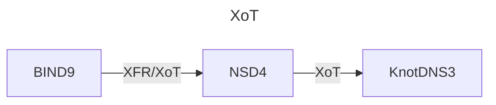

# poc-xot
This is a Proof of Concept for running name servers where the zone transfer is done over an encrypted channel. This encrypted channel is standardized by the IETF and named XoT [RFC9103](https://www.rfc-editor.org/info/rfc9103). 

In this PoC BIND9 is used as a primary name server, serving a zone (example.nl) over traditional AXFR/IXFR and a zone over XoT (nimago.nl). NSD4 is used as a secondary to the BIND9 name server, and as a primary for KnotDNS3 serving the zones only over XoT. The KnotDNS name server is the endpoint.

## Config files
A complete set of working config files is included in this repository. For now these files are handcrafted.

## TSIG Key

## TLS certificates

## Components
| Name      | Version | Description
|-----------|---------|--------------------------------------------------------------
| bind      | 9.18.28 | Primary nameserver with a standard XFR and with XFR-over-TLS
| nsd       |  4.10.1 | Secondary nameserver with a standard XFR and with XoT also acting as primary with only XoT |
| knot      |   3.4.2 | Secondary nameserver with only XoT |
| dnsutils  |     N/A | Tooling for drilling, digging, delving, etc. |
| dns-proxy |  3.32.4 | Name resolution within the xotnet network |

