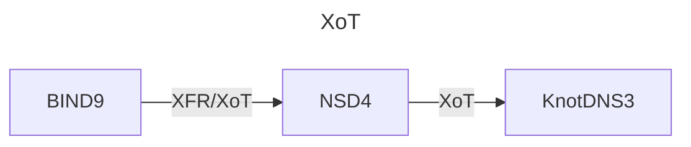

# poc-xot
Proof-of-concept for XoT

## Components
| Name      | Version | Description
|-----------|---------|--------------------------------------------------------------
| bind      | 9.18.28 | Primary nameserver with a standard XFR and with XFR-over-TLS
| nsd       |  4.10.1 | Secondary nameserver with a standard XFR and with XoT also acting as primary with only XoT |
| knot      |   3.4.2 | Secondary nameserver with only XoT |
| dnsutils  |     N/A | Tooling for drilling, digging, delving, etc. |
| dns-proxy |  3.32.4 | Name resolution within the xotnet network |

