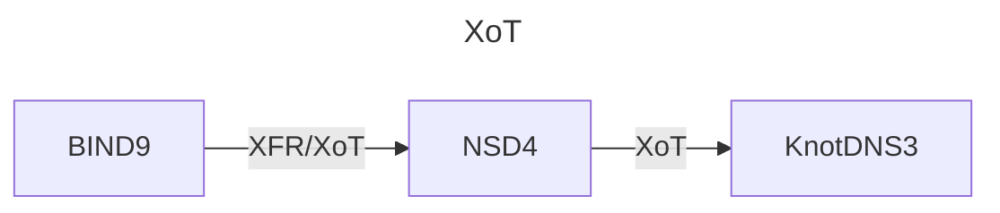

# poc-xot
This is a Proof of Concept for running name servers where the zone transfer is done over an encrypted channel. This encrypted channel is standardized by the IETF and named XoT [RFC9103](https://www.rfc-editor.org/info/rfc9103). 

In this PoC BIND9 is used as a primary name server, serving a zone (example.nl) over traditional AXFR/IXFR and a zone over XoT (nimago.nl). NSD4 is used as a secondary to the BIND9 name server, and as a primary for KnotDNS3 serving the zones only over XoT. The KnotDNS name server is the endpoint.

## Config files
A complete set of working config files is included in this repository. For now these files are handcrafted.

## TSIG Key
/usr/sbin/tsig-keygen -a HMAC-SHA256 xotkey >xotkey.tsig.  ==> ct.sh

## TLS certificates
openssl genrsa -des3 -out myCA.key 2048
openssl req -x509 -new -nodes -key myCA.key -sha256 -days 1825 -out myCA.pem

Enter pass phrase for myCA.key:
You are about to be asked to enter information that will be incorporated
into your certificate request.
What you are about to enter is what is called a Distinguished Name or a DN.
There are quite a few fields but you can leave some blank
For some fields there will be a default value,
If you enter '.', the field will be left blank.
-----
Country Name (2 letter code) [AU]:NL
State or Province Name (full name) [Some-State]:
Locality Name (eg, city) []:Arnhem
Organization Name (eg, company) [Internet Widgits Pty Ltd]:SIDN B.V.
Organizational Unit Name (eg, section) []:Team DNS
Common Name (e.g. server FQDN or YOUR name) []:cert.dev
Email Address []:dns@sidn.nl

openssl genrsa -out xot.key 2048
openssl req -new -key xot.key -out xot.csr

Country Name (2 letter code) [AU]:NL
State or Province Name (full name) [Some-State]:
Locality Name (eg, city) []:Arnhem
Organization Name (eg, company) [Internet Widgits Pty Ltd]:SIDN B.V.
Organizational Unit Name (eg, section) []:Team DNS
Common Name (e.g. server FQDN or YOUR name) []:bind9.dev
Email Address []:dns@sidn.nl

Please enter the following 'extra' attributes
to be sent with your certificate request
A challenge password []:
An optional company name []:

vim xot.ext
authorityKeyIdentifier =keyid,issuer
basicConstraints=CA:FALSE
keyUsage = digitalSignature, nonRepudiation, keyEncipherment, dataEncipherment
subjectAltName = @alt_names

[alt_names]
DNS.1 = xot

openssl x509 -req -in xot.csr -CA myCA.pem -CAkey myCA.key \
-CAcreateserial -out xot.crt -days 825 -sha256 -extfile xot.ext

openssl x509 -inform PEM -in xot.crt >xot.pem

cp myCA.pem ../bind/myCA.crt
cp myCA.pem ../nsd/myCA.crt
cp myCA.pem ../knot/myCA.crt

cp xot.key ../nsd/config
cp xot.pem ../nsd/config
cp xot.key ../bind/config
cp xot.crt ../bind/config
cp xot.key ../knot/config
cp xot.crt ../knot/config

Create pin for knotdns:
openssl x509 -in my-certificate.crt -pubkey -noout | openssl pkey -pubin -outform der | openssl dgst -sha256 -binary | openssl enc -base64
## Components
| Name      | Version | Description
|-----------|---------|--------------------------------------------------------------
| bind      | 9.18.28 | Primary nameserver with a standard XFR and with XFR-over-TLS
| nsd       |  4.10.1 | Secondary nameserver with a standard XFR and with XoT also acting as primary with only XoT |
| knot      |   3.4.2 | Secondary nameserver with only XoT |
| dnsutils  |     N/A | Tooling for drilling, digging, delving, etc. |
| dns-proxy |  3.32.4 | Name resolution within the xotnet network |

